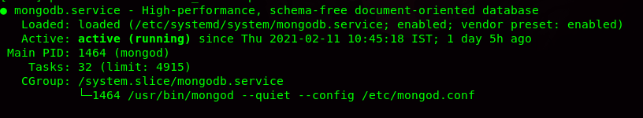

# Installation Guid for MongoDB

| Sl No  | Version  | Operating System |
|:-:|:-:|:-:|
| 1  | [latest(v4.2.1)](#installation-of-mongodb421-ubuntu-1804)  | Ubuntu 18.04(BionicBeaver)  |
| 2  | [latest(v4.2.1)](#installation-of-mongodb421--ec2-ami-linux)  | Amazon AMI Linux |


---

<br><br><br>

- ### Installation of MongoDB(4.2.1) Ubuntu 18.04

1. Ubuntu’s official software package repositories comes with the latest version of MongoDB, and can be easily installed using the APT package manager.

First update the system software package cache to have the most latest version of the repository listings.

```sh
sudo apt update
```

2. Next, install MongoDB package that includes several other packages such as mongo-tools, mongodb-clients, mongodb-server and mongodb-server-core.

```sh
sudo apt install mongodb
```

3. Once you have successfully installed it, the MongoDB service will start automatically via systemd and the process listens on port 27017. You can verify its status using the systemctl command as shown.

```sh
sudo systemctl status mongodb
```


4. The MongoDB installation comes as a systemd service and can be easily manageable via a standard systemd commands as shown.

To stop running MongoDB service, run the following command.

```sh
 sudo systemctl stop mongodb	
```

To start a MongoDB service, type the following command.

```sh
sudo systemctl restart mongodb
```

To disable automatically started MongoDB service, type the following command.

```sh
sudo systemctl disable mongodb	
```

To enable again MongoDB service, type the following command.

```sh
sudo systemctl enable mongodb	
```

---

<br><br><br>
- ### Installation of MongoDB(4.2.1)  EC2 AMI Linux

1. For MongoDB 4.2.1, create the below file using VI or any other editor:
   
```sh
vi /etc/yum.repos.d/mongodb-org-3.0.repo 
```

Add the content below in the above-created file:

```text
[mongodb-org-4.2.1]
name=MongoDB Repository
baseurl=https://repo.mongodb.org/yum/amazon/2013.03/mongodb-org/4.2.1/x86_64/
gpgcheck=1
enabled=1
```

2. Install MongoDB Using the Below Command

```sh
sudo yum install -y mongodb-org
```

3. Start MongoDB Service Using the Below Command

```sh
sudo service mongod start
```
4. Start MongoDB on Reboot

You can optionally ensure that MongoDB will start following a system reboot by issuing the following command:

```sh
sudo chkconfig mongod on
```

Once the service is started, you can check the status of your Mongo shell. To check the Mongo shell status, use the below command:

```sh
sudo service mongod status
```


---